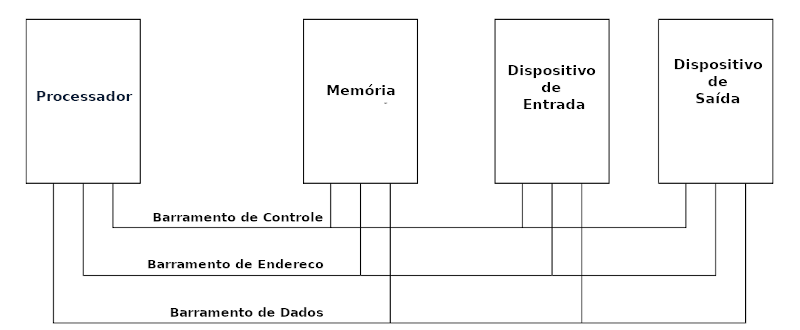
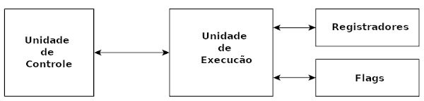

# 4. O Processador

#### Anterior: [3.6 Memória Cache](./cache.md)  
#### Próximo: [4.1 Partes do Processador](./partes_processador.md)

---

Embora diferentes famílias de processadores incorporem diferentes instruções e possibilidades, existe um conjunto de componentes comum a maioria deles. Para recaptular, vemos abaixo novamente a estrutura básica de um computador:  

  

* **O Processador**
Contém o hardware e instruções que controlam a operação do computador. É conectado a outros elementos da máquina utilizando três barramentos: dados, controle e endereço.  

* **Barramentos**  
O **barramento de controle** é utilizado para sincronizar as funções entre o processador e os elementos da estrutura do computador. O **barramento de dados** é utilizado para mover dados entre o processador e elementos externos do sistema. Um exemplo é a leitura de dados da memória: O processador coloca o endereço a ser lido no **barramento de endereço** e a memória retorna colocando o valor armazenado naquela posição no barramento de dados para que o processador possa acessar.  

---

O processador é constituído de vários componentes. Cada componente possui uma função específica. A linguagem Assembly é capaz de manipular cada um destes elementos, por isso é importante conhecê-los. Eles são:  

- Unidade de Controle
- Unidade de Execução
- Registradores
- Flags

  
