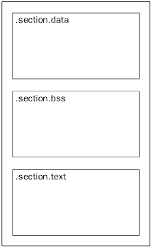
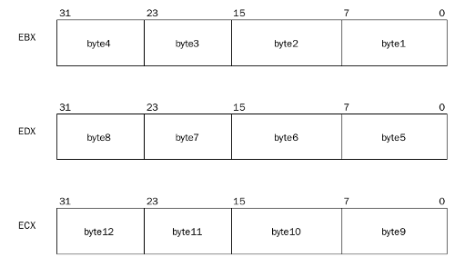

# 6. Primeiro Programa Assembly

#### Próximo: [6. ](./md)  
#### Anterior: [5.4 O Compilador](./o_compilador.md)  

  ---  

  O código desenvolvido em linguagem assembly é constituído de seções bem definidas, cada uma com um diferente propósito. As três mais usadas são:  

  - seção **data**  
  - seção **bss**  
  - seção **text**  

  A seção *text* é obrigatória em todos os programas assembly. É nesta seção em que as instruções são declaradas. As seções *data* e *bss* são opcionais, porém aparecem na maioria dos programas. A seção *data* declara elementos de dados que possuem valor inicial. Estes elementos são utilizados como variáveis no programa assembly. A seção *bss* declara elementos de dados que são instanciados com o valor zero (ou nulo). Estes elementos são geralmente utilizados como área de buffer do programa.  

  Abaixo temos como as seções são delimitadas em um program assembly. Não existe uma regra muito bem definida para as posições, porém a seção *bss* **deve** preceder a seção *text*. Já a seção *data* pode ocupar qualquer posição. A imagem mostra a posição mais usual das seções.  

   

 ## O ponto de início  

 Quando um programa assembly é convertido em um executável, o linker deverá saber qual o ponto de início do programa. Para programas simples não é difícil encontrá-lo, porém para programas maios complexos que utilizam diversas funções encontrar este ponto pode ser um problema.  

 Para resolver este problema, o assembler GNU declara um identificador padrão que indica o início do programa. Ele é o **_start**. Se o linker não encontrar este identificador ele retornará uma mensagem de erro.  

 *OBS: você também pode utilizar outra palavra para definir o início do programa. Basta utilizar o parâmetro -e do linker para informar qual o ponto de entrada*  

 Outra questão importante é que você deverá fazer com que este ponto de entrada seja global, ou seja, acessível a programas externos. isso é feito utilizando a diretiva *.globl.*  

 Sendo assim, o esboço de um programa assembly ideal seria assim:  

 `  
 .section.data  
<dados inicializados aqui>  

.section .bss  
<dados não inicializados aqui>  

.section .text  
.globl _start  
_start:  

<código segue aqui>  
`  

## O Comando CPUID  

O comando CPUID é utilizado para requisitar informações sobre o processador que está executando o programa. Ele utiliza um único valor em uma registrador como entrada.  O registrador *EAX* é utilizado para determinar qual informação é produzida pela instrução CPUID. Dependendo do valor no registrador *EAX*, o comando CPUID irá produzir uma informação diferente sobre o processador nos registradores *EBX*, *ECX* e *EDX*. A informação é retornada como uma série de bits e flags a serem interpretadas. A seguinte tabela mostra as diferentes opções de saída para o comando:  

|Valor em EAX|Valor CPUID|
|:---:|:---:|
|0 | ID do fabricante e a opção máxima do CPUID suportado|
|1 | Tipo do processador, família, modelo e informação de stepping|
|2 | Configuração de Cache|
|3 | Número de Série|
|4 | Outras configurações de cache (núm. de threads, numero de núcleos, entre outros)|
|5 | Informação sobre monitor|
|80000000h | ID estendido do fabricante e níveis suportados|
|80000001h | Tipo do processador, família, modelo e informação de stepping extendidos|
|80000002h-80000004h | Nome estendido do processador|  

No programa de exemplo que vamnos criar, utilizamos a opção *0* da tabela para receber simplesmente o ID do fabricante. Quando o valor 0 é colocado no registrador *EAX* e a instrução CPUID é executada, o processador retorna o ID do fabricante em *EBX*, *EDX* e *ECX* de acordo com o seguinte:  

- O *EBX* contém 4 bytes menos significativos da string,  
- O *EDX* contém os 4 bytes intermediários da string,   
- O *ECX* contém os 4 bytes mais significativos da string.  

*OBS: Os caracteres da string são distribuídos nos registradores no formato **little-endian**; ou seja, a primeira parte da string é posicionada nos byts menos significativos conforme podemos ver na imagem abaixo.*  

  

## O Programa  

Abaixo temos o código completo desde programa inicial e posteriormente é comentada parte por parte do programa:  

`  
.section .data  

 output:  
  .ascii "O ID do Fabricante e 'xxxxxxxxxxxx'\n"  

.section .text  
 .globl _start  
  _start:  

  movl $0, %eax  
  cpuid  
  movl $output, %edi  
  movl %ebx, 22(%edi)  
  movl %edx, 26(%edi)  
  movl %ecx, 30(%edi)  
  movl $4, %eax  
  movl $1, %ebx  
  movl $output, %ecx  
  movl $36, %edx  
  int $0x80  
  movl $1, %eax  
  movl $0, %ebx  
  int $0x80  
  `  
  ### As partes do programa  

  *.section .data*  

 *output:*  
  *.ascii "O ID do Fabricante e 'xxxxxxxxxxxx'\n"*  

  Como descrito anteriormente, a seção data é utilizada para inicializar variáveis. Aqui estamos declarando a variável output com a stringue que segue. O parâmetro *.ascii* define o tipo de caracteres que estamos utilizando. A parte da string com vários *x* funciona como uma "reserva de espaço" que vamos sobrescrever com o valor que queremos posteriormente.  
  
  *.section .text*  
 *.globl _start*  
  *_start:*  

  Nesta parte iniciamos a seção text onde ficará a lógica propriamente dita. Após a inicialização declaramos a instrução global *_start* que dirá ao compilador onde nosso código se inicia. Logo abaixo iniciamos a parte do código justamente com a instrução *_start:_  
  
  *movl $0, %eax*  
  *cpuid*  
    
  Foi explicado anteriormente que precisamos de um valor zero no registrador EAX (acumulador para operandos e resultados) para que o comando *cpuid* funcione como queremos. Portanto neste caso, "movemos" um valor 0 para o registrador EAX e logo em seguida invocamos o comando *cpuid*.  
    
  *movl $output, %edi*  
  *movl %ebx, 22(%edi)*  
  *movl %edx, 26(%edi)*  
  *movl %ecx, 30(%edi)*  
  
  Logo após a execução do comando cpuid (que retornará o ID do fabricante do processador), devemos coletar a resposta nos registradores de saída e colocá-la no lugar dos nossos *x* em nossa string. Portanto, "movemos" o endereço da nossa string **output** para o registrador EDI (ponteiro de dados para destino de operação com strings).  
  Quando a string com o ID do processador foi armazenada na memória primeira parte dela foi armazenada nos bytes menos significativos (retornada no registrador EBX) e a parte final nos bytes mais significativos (retornada no registrador ECX). Sendo assim, para escrever o ID de forma correta em nossa string devemos colocar na ordem "O ID do Fabricante e 'valor EBX - valor EDX - valor ECX'\n". Contando as posições dos bytes da string, começando do zero (cada caractere é 1 byte), temos que o primeiro byte está na posição 22 dentro do endereço na nossa string **output**. Sendo assim, "movemos" a primeira parte da string que está no registrador EBX para a posição 22. Quatro bytes depois posicionamos a parte intermediária do ID (posição 26) que está nmo registrador EDX e nos quatro últimos bytes (a partir da posição 30) os quatro últimos bytes que estão no registrador ECX.  

  *movl $4, %eax*  
  *movl $1, %ebx*  
  *movl $output, %ecx*  
  *movl $36, %edx*  
  *int $0x80*  
    
  Já temos tudo posicionado em ordem, então chega a hora de exibir na tela. Para arquitetura 32-bits vamos utilizar a instrução **int 0x80** do Linux. A parte **int** significa interrupção (*interruption*) que interrompe o fluxo do programa e redireciona para o *handler* que vai lidar com ele. O comando **0x80** é um comando do kernel do Linux, uma chamada de sistema. Concluímos então que o programa será interrompido naquela etapa e direcionado ao Kernel do Linux para lidar com ela. Mas então, o que o Kernel fará com ela? Essa instrução recebe 4 argumento: o primeiro deles deve ser posicionado em EAX, como vemos em *movl $4, %eax*. O **valor 4 significa simplesmente escrever (sys_write)**. O segundo argumento é posicionado em EBX. **O valor 1 no nosso caso é quem vai decodificar a string e aponta para a saída padrão *stdout***. O terceiro argumento é posicionado em ECX e é a **mensagem que será escrita na saída padrão**. No nosso caso, colocamos o valor da nossa string final. E o quarto parâmetro em EDX é o **tamanho da nossa string (36 caracteres ou bytes)**. Em resumo, definimos todos os valores dos parâmetros e executamos o comando.

  *OBS: para sistemas de 64-bits não é usual a utilização do comando 0x80 e sim do comando syscall com outras posições de parâmetros. Para sistemas 64-bits também os nomes dos registradores também são levemente diferentes. Esse tipo de sistema será tratado em seções futuras*  

  *movl $1, %eax*  
  *movl $0, %ebx*  
  *int $0x80*  

  Após executado o envio da string para o terminal é necessário finalizar o programa. Para isso é invocado o mesma chamada de sistema do Linux porém com parâmetros diferentes. o valor **1 no registrador EAX significa que estamos invocando a chamada de saída (sys_exit)** e **no registrador EBX colocamos o valor de retorno de nosso programa (no caso 0 para sucesso)**

  ### Executando o Programa  

  Para executar o programa primeiro temos que criar um objeto com o nosso **assembler**. Se nosso programa se chama *primeiro_programa.s* então executamos o segunte comando:  

  `  
  as -o primeiro_programa.o primeiro_programa.s  
  `  

  O comando anterior terá como saída um arquivo de objeto chamado *primeiro_programa.o*. A seguir, precisamos do **linker** para criar um executável. Sendo assim, executamos o seguinte comando:  

  `  
  ld -o primeiro_programa primeiro_programa.o  
  `  

  O comando aterior criará um executável chamado simplesmente de *primeiro_programa*. Para executá-lo, bastata executar:  

  `  
  ./primeiro_programa
  O ID do Fabricante e 'GenuineIntel'
  `  