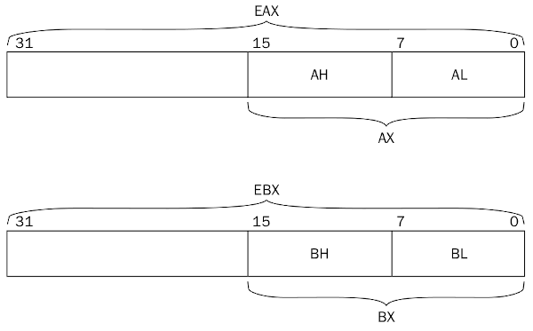

# 4.2 Tipos de Registradores

#### Anterior: [4.1 Partes do Processador](./partes_processador.md)   
#### Próximo: [4.3 Tipos de Flags](./tipos_flags.md)  

Na seção 3.7 já foi tratado um pouco sobre registradores. Aqui estão alguns outros detalhes adicionais.

--- 

## REGISTRADORES DE USO GERAL  

Estes registradores armazenam dados temporariamente conforme processado. Possuem 32 bits na arquitetura de 32 bits. Cada nova versão é criada para ser compatível com as versões anteriores. Portanto, códigos que utilizam registradores de 8-bits como no caso dos chips 8080 ou 16-bits nos modelos antigos do x86 continuam válidos nos de 32-bits.  

Enquanto a maioria dos registradores de uso geral podem armazenar qualquer tipo de dado, alguns adquiriram usos especiais (e que são usados constantemente em programas assembly). Eles estão listado abaixo:  

|REGISTRADOR|DESCRIÇAO|
|:---:|:---:|
|EAX|Acumulador para operandos e resultados|
|EBX|Ponteiro para dado na memória|
|ECX|Contador para strings ou loops|
|EDX|Ponteiro para Entrada/Saída|
|EDI|Ponteiro de dados para denstino de operação com strings|
|ESI|Ponteiro para origem de strings para operação|
|ESP|Ponteiro de Pilha (Stack)|
|EBP|Ponteiro de dados de Pilha (Stack)|
  
Na seção 3.7 os registradores foram nomeados por AX, BX, CX e DX. Estes nomes foram utilizados por se tratarem de registradores de 16-bits. Registradores com capacidades (versões anteriores) menores também podem ser referenciados na arquitetura 32-bits utilizando a seguinte referência:  

  

Referenciando AX, a palavra binária menos significativa de EAX será utilizado. Referenciando AL, o byte menos significativo de EAX será utilizado. AH faz referência ao byte mais significativo, depois de AL.  

## REGISTRADORES DE SEGMENTO  

Os registradores de segmento são utilizados especificamente para referenciar posições na memória. A plataforma 32-bits permite três diferentes métodos de acesso ao sistema de memória: 

- Modelo de memória linear (Flat) - representa todo sistema de memória como um espaço de endereçamento contínuo. Toda as instruções, dados e a pilha estão contidos no mesmo espaço. Cada posição na memória é acessada popr um endereço específico, chamado "endereço linear".  

- Modelo de memória segmentado - divide o sistema de memória em grupos independentes de segmentos, referenciados por ponteiros localizados nos registradores de segmento. Cada segmento é utilizado para armazenar um tipo específico de dado. Um segmento é utilizado para instruções, outro para dados e um terceiro para a pilha do programa.  

Posições de memória nos segmentos são definidos por endereços lógicos. Um endereço lógico consiste no endereço de um segmento e um endereço de offset. O processador traduz um endereço lógico para seu correspondente endereço linear para acessar um byte na memória.  
O registrador de segmento é utilizado para armazenar o endereço do segmento para o acesso a um dado específico. Abaixo temos uma tabela com as descrições dos endereços de segmentos disponíveis:  

|Registrador de Segmento|Descrição|
|:---:|:---:|
|CS|Segmento de código|
|DS|Segmento de Dados|
|SS|Segmento de Pilha (Stack)|
|ES|Segmento Extra de Ponteiro|
|FS|Segmento Extra de Ponteiro|
|GS|Segmento Extra de Ponteiro|

Cada registrador de segmento possui 16-bits e contém um ponteiro para o início do segmento de memória específicado. O registrador CS contém o ponteiro para o segmento de código na memória. O segmento de código é onde as instruções são armazenadas. O processador requisita os códigos de instrução da memória baseado no valor de CS e um valor de offset contido no ponteiro de instrução (EIP - Extended Instruction Pointer).  Um programa não pode alterar ou carregar explicitamente o registrador CS. O processador atribui seu valor conforme é atribuido ao programa um endereço na memória.  

Os registradores de segmento DS, ES, FS e GS são utilizados para apontar para segmentos de dados. Existindo quatro segmentos de dados separados, o programa pode ajudar a separar elementos de dados, garantindo que eles não serão sobrepostos. O programa deve carregar os registradores de segmento de dados com o valor de ponteiro apropriado para o segmento e referenciar posições individuais de memória utilizando um valor de offset.  

O registrador SS é utilizado para apontar para o segmento de pilha. Ele contém os valores de dados passados para funções e procedimentos dentro do programa.  

- Modo real - Se um programa está utilizando o modo real de endereçamento, todos os seus registradores de segmento apontam para o endereço zero linear e não são alterados pelo programa. Todos os códigos de instrução, elementos de dados e pilha são acessados diretamente pelo seu endereço linear.

## REGISTRADORES DE PONTEIRO DE INSTRUÇÃO   

O registrador de ponteiro de instrução (ou EIP), algumas vezes chamado de *contador*, mantém a posição da próxima instrução de código a ser executada. Uma aplicação não pode modificar diretamente um ponteiro de instrução, Você não pode definir um endereço de memória e carregá-lo no EIP. Ao invés disso, você deve utilizar instruções de controle normais do programa, como *jump*, para alterar a próxima instrução a ser lida.  
Se utilizado o modelo de memória linear, o ponteiro de instrução contém o endereço linear da posição na memória para a próxima instrução. Se utilizar o modelo de segmento, o ponteiro de instruição apontará para o endereço lógico, referenciado pelo registrador CS.  

## REGISTRADORES DE CONTROLE  
Os cinco registradores de controle são uitilizados para determinar o modo de operação do processador e a característica da tarefa atual. Os registradores de controle estão descritos individualmente abaixo:  

|Registrador de controle|Descrição|
|:---:|:---:|
|CR0|Flag (sinalização) do sistema que controla o modo de operação e o status do processador|
|CR1|Não utilizado|
|CR2|Informação de falha de paginação da memória|
|CR3|Informação de diretório de paginação da memória|
|CR4|Flag (sinalização) que habilita opções do processador e indica sua opções|

O valor no registrador de controle não pode ser diretamente acessado, mas o dado contido no registrador de controle pode ser movido para um registrador de uso geral. Uma vez que o dado está em um registrador de uso geral, um programa pode examinar o bit de flag e determinar o status da operação do processador ou da tarefa atual.  

Se necessária uma alteração na flag do registrador de controle, ela pode ser realizada no registrador de uso geral e este registro ser movido para o registrador de controle.