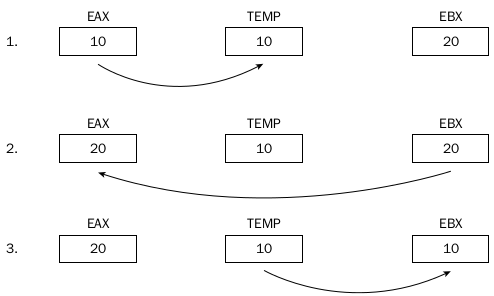

# 6.2.2 Trocando Dados

#### Próximo: [7.0 A Pilha (Stack)](./a_pilha.md)  
#### Anterior: [6.2.1 MOV Condicional](./mov_condicional.md) 

---  
  
  Algumas vezes em programação é necessário trocar dados entre posições. Para fazer isso utilizando a instrução *mov* é necessário um registrador intermediário temporário. Por exemplo, para trocar os valores entre *eax* e *ebx* você teria que fazer algo como abaixo:  

    

  As instruções ficariam algo como:  

  *movl %eax, %ecx*  
  *movl %ebx, %eax*  
  *movl %ecx, %ebx*  

  Porém o assembly possui um conjunto de instruções para intercâmbio de dados. Cada um possui uma função específica. Seguem as instruçòes:  

  |Instrução|Descrição|
  |:---:|:---:|
  | XCHG | Carry Flag |
  | BSWAP | Intercâmbio de valores de dois registradores ou entre um registrador e uma posição na memória |
  | XADD | Inverte a ordem de um byte em um registrador 32-bits |
  |CMPXCHG | Intercâmbio de dois valores e armazena a soma em um operando de destino |
  |CMPXCHG8B | Compra dois valores de 64-bits e faz o intercâmbio entre eles |  

  ## XCHG  

  A instrução XCHG é a mais simples do grupo. Ela faz o intercâmbio de valores entre dois registreadores de propósito geral ou entre um registrador e uma posição na memória. O formato de utilização da instrução é:  

  *xchg operando1, operando2*  

  A instrução pode ser usada com qualquer registrador desde que eles tenham o mesmo tamanho. Quando um dos operandos é uma posicão na memória, o sinal de *LOCK* do processador é ativado automaticamente, prevenindo qualquer outro processador de acessar a posição na memória durante a operação.  

  *OBS: Muita atenção ao utilizar a instrução XCHG com posições na memória. O processo de LOCK é um grande consumidor de tempo e pode diminuir a performance de programa*  

  ## BSWAP  

  A instrução BSWAP é uma ferramenta poderosa para se ter em mãos quando se trabalha com sistemas de diferentes orientações de bytes. o BSWAP inverte a ordem dos bytes do registrador. Em arquitetura 32-bits os bits de 0 a 7 são invertidos com os bits de 24 a 31 , enquanto os bits de 8 a 15 são invertidos com os de 16 a 23. Isso é ilustrado abaixo:  

    

 ## XADD  

 A instrução XADD é utilizada para intercambiar valores entre dois registradores ou posições da memória e um registrador. Além disso ele adiciona os valores e armazena o resultado em um local de destino (também um registrador ou posição na memória). O formato para utilização da instrução é  

 *xadd origem, destino*  

 onde origem deve ser um registrador e destino pode ser um registrador ou posição na memória e irá conter o resultado da adição.  

 ## CMPXCHG  

 A instrução CMPXCHG compara o operando de destino com os valores no registrador acumulador (*eax, ax, al..*). Se o valor é igual, o valor do operando de origem é carregado no operando de destino. Se o valor não é igual, o operando de destino é carregado no registrador acumulador.  Aplicação:  

  *cmpxchg origem, destino*  

  Exemplo:  

  *.section .data*  
  *data:*  
    *.int 10*  
  
  *.section .text*  
  *.globl _start*  
    *_start:*  

    *movl $10, %eax*  
    *movl $5, %ebx*  
    *cmpxchg %ebx, data*  
    *movl $1, %eax*  
    *int $0x80*  
  
No exemplo anterior o valor armazenado em *data* (10) será comparado com o valor em *eax* (10). Como eles são iguais, o valor no operando *ebx* será escrito no local referenciado por *data* e o valor de *ebx* continuará o mesmo.  

## CMPXCHG8B  

Podemos deduzir pelo seu nome que a instrução *cmpxchg8b* é similar a instrução *cmpxchg* com uma pequena alteração - ela opera em valores de 8 bytes. Esta instrução utiliza apenas um operando:  

*cmpxchg8b destino*  

O valor armazenado em *destino* será comparado com o valor contido nos registradores *edx* e *eax* (com *edx* sendo o registrador mais significativo e *eax* sendo o menos significativo). Se *destino* for igual ao valor contido no par *edx:eax*, o valor de 64 bits contido em *ecx:ebx* será movido para o *destino*. Caso negativo, o valor contido em *destino* ser[a movido para *edx:eax*.  

