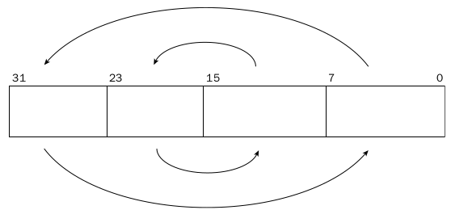

# 6.2.2 Trocando Dados

#### Próximo:   
#### Anterior: [6.2.1 MOV Condicional](./mov_condicional.md) 

---  
  
  Algumas vezes em programação é necessário trocar dados entre posições. Para fazer isso utilizando a instrução *mov* é necessário um registrador intermediário temporário. Por exemplo, para trocar os valores entre *eax* e *ebx* você teria que fazer algo como abaixo:  
  
    

  As instruções ficariam algo como:  

  *movl %eax, %ecx*  
  *movl %ebx, %eax*  
  *movl %ecx, %ebx*  

  Porém o assembly possui um conjunto de instruções para intercâmbio de dados. Cada um possui uma função específica. Seguem as instruçòes:  

  |Instrução|Descrição|
  |:---:|:---:|
  | XCHG | Carry Flag |
  | BSWAP | Intercâmbio de valores de dois registradores ou entre um registrador e uma posição na memória |
  | XADD | Inverte a ordem de um byte em um registrador 32-bits |
  |CMPXCHG | Intercâmbio de dois valores e armazena a soma em um operando de destino |
  |CMPXCHG8B | Compra dois valores de 64-bits e faz o intercâmbio entre eles |  

  ## XCHG  

  A instrução XCHG é a mais simples do grupo. Ela faz o intercâmbio de valores entre dois registreadores de propósito geral ou entre um registrador e uma posição na memória. O formato de utilização da instrução é:  

  *xchg operando1, operando2*  

  A instrução pode ser usada com qualquer registrador desde que eles tenham o mesmo tamanho. Quando um dos operandos é uma posicão na memória, o sinal de *LOCK* do processador é ativado automaticamente, prevenindo qualquer outro processador de acessar a posição na memória durante a operação.  

  *OBS: Muita atenção ao utilizar a instrução XCHG com posições na memória. O processo de LOCK é um grande consumidor de tempo e pode diminuir a performance de programa*  

  ## BSWAP  

  A instrução BSWAP é uma ferramenta poderosa para se ter em mãos quando se trabalha com sistemas de diferentes orientações de bytes. o BSWAP inverte a ordem dos bytes do registrador. Em arquitetura 32-bits os bits de 0 a 7 são invertidos com os bits de 24 a 31 , enquanto os bits de 8 a 15 são invertidos com os de 16 a 23. Isso é ilustrado abaixo:  

    